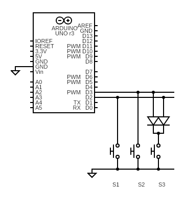
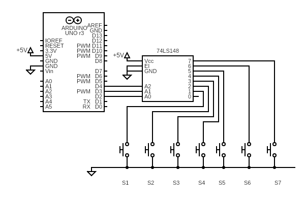

# Binary Encoding

When each button is connected to a single pin, the number of pins increases
linearly with the number of buttons. If we have a limited number of pins,
we can support a larger number of buttons by using an encoding scheme.

One of the simplest encoding scheme is the [Binary
Encoding](http://www.learnabout-electronics.org/Digital/dig44.php). With 2
pins, we can distinguish 4 (`2^2`) different combinations. With 3
pins, we can distinguish 8 (`2^3`) different combinations. In general, the
number of possible states of `N` pins is (`2^N`). One combination must be used
to represent the condition of "no button pressed". So the number of buttons that
can be supported by `N` pins is `2^N - 1`.

There are at least 3 ways to wire up the buttons to binary encode their
activations into the smaller number of pins:
* diodes
* logical gates (AND, OR, NOT gates)
* integrated circuit, e.g. the [74LS148](https://www.ti.com/product/SN74LS148)

For small number of pins (2 or 3), diodes can be used to implement the binary
encoding. For 4 or more pins, the number of diodes increases exponentially, so
it is probably easier to use logic gates or integrated circuit.

One disadvantage of encoding multiple buttons into a small number of pins is
that it is no longer possible to detect multiple buttons being pressed at the
same time.

I created 2 special subclasses of `ButtonConfig` to support a 4-to-2 binary
encoding and an 8-to-3 binary encoding:

* `Encoded4To2ButtonConfig`
* `Encoded8To3ButtonConfig`

and I created a more general class to handle `N >= 4` pins:

* `EncodedButtonConfig`

(although it could be used for `N = 2` and `N = 3`).

The software does not care how the binary encoding is actually implemented in
hardware.

## 4-to-2 Encoding

This is the simplest example of binary encoding. Using 2 pins, we can support 3
buttons with 2 diodes. Here is the circuit diagram:



Of the 4 possible states of 2 pins, the `00` state corresponding to S0 is used
to indicate "no button pressed". Therefore, we can support 3 buttons
(S1, S2, S3) with 2 pins. We will use the internal pullup resistor using the
`pinMode(PIN, INPUT_PULLUP)` call. The buttons pull the pins down to `LOW` when
pressed. The pin states of the 3 buttons are:
```
PIN0 = D2
PIN1 = D3

---+------+------+
Btn| PIN1 | PIN0 |
---+------+------+
 - | HIGH | HIGH |
S1 | HIGH |  LOW |
S2 |  LOW | HIGH |
S3 |  LOW |  LOW |
---+------+------+
```

The `Encoded4To2ButtonConfig` class allows us to assign "virtual" pin numbers to
the 3 buttons, like this:
```C++
#include <AceButton.h>
using namespace ace_button;

static const uint8_t BUTTON_PIN0 = 2;
static const uint8_t BUTTON_PIN1 = 3;

Encoded4To2ButtonConfig buttonConfig(BUTTON_PIN0, BUTTON_PIN1);

// Create 3 buttons, assigning them virtual pin numbers 1, 2 and 3.
AceButton b1(&buttonConfig, 1);
AceButton b2(&buttonConfig, 2);
AceButton b3(&buttonConfig, 3);

void handleEvent(AceButton*, uint8_t, uint8_t);

void setup() {
  delay(1000); // wait for stability
  Serial.begin(115200);
  while (! Serial); // Wait until Serial is ready - Leonardo/Micro

  // Configure the real pins for pullup wiring
  pinMode(BUTTON_PIN0, INPUT_PULLUP);
  pinMode(BUTTON_PIN1, INPUT_PULLUP);

  // Configure the ButtonConfig with the event handler, and enable all higher
  // level events.
  buttonConfig.setEventHandler(handleEvent);
  buttonConfig.setFeature(ButtonConfig::kFeatureClick);
  buttonConfig.setFeature(ButtonConfig::kFeatureDoubleClick);
  buttonConfig.setFeature(ButtonConfig::kFeatureLongPress);
  buttonConfig.setFeature(ButtonConfig::kFeatureRepeatPress);
}

void loop() {
  // Should be called every 4-5ms or faster, for the default debouncing time
  // of ~20ms.
  b1.check();
  b2.check();
  b3.check();
}

void handleEvent(AceButton* button, uint8_t eventType, uint8_t buttonState) {
  Serial.print(F("handleEvent(): "));
  Serial.print(F("virtualPin: "));
  Serial.print(button->getPin());
  Serial.print(F("; eventType: "));
  Serial.print(eventType);
  Serial.print(F("; buttonState: "));
  Serial.println(buttonState);
}
```

## 8-to-3 Encoding

If we use 3 pins, we can support 7 buttons (8 possible states of 3 pins, with
one state representing "no button" pressed). The binary encoding can be achieved
using 9 diodes, as shown in the following circuit:


The same encoding can be implemented using the [74LS148](https://www.ti.com/product/SN74LS148) chip like this:



Of the 8 possible states of 3 pins, the `000` state corresponding to S0 is used
to indicate "no button pressed". Therefore, we can support 7 buttons
(S1, S2, ..., S7) with 3 pins. We will use the internal pullup resistor using
the `pinMode(PIN, INPUT_PULLUP)` call. The buttons pull the pins down to `LOW`
when pressed. The pin states of the 3 buttons are:
```
PIN0 = D2
PIN1 = D3
PIN2 = D4

---+------+------+------+
Btn| PIN2 | PIN1 | PIN0 |
---+------+------+------+
 - | HIGH | HIGH | HIGH |
S1 | HIGH | HIGH |  LOW |
S2 | HIGH |  LOW | HIGH |
S3 | HIGH |  LOW |  LOW |
S4 |  LOW | HIGH | HIGH |
S5 |  LOW | HIGH |  LOW |
S6 |  LOW |  LOW | HIGH |
S7 |  LOW |  LOW |  LOW |
---+------+------+------+
```

The `Encoded8To3ButtonConfig` class allows us to assign "virtual" pin numbers to
the 7 buttons, like this:

```C++
#include <AceButton.h>
using namespace ace_button;

static const uint8_t BUTTON_PIN0 = 2;
static const uint8_t BUTTON_PIN1 = 3;
static const uint8_t BUTTON_PIN1 = 4;

Encoded8To3ButtonConfig buttonConfig(BUTTON_PIN0, BUTTON_PIN1, BUTTON_PIN2);

// Create 3 buttons, assigning them virtual pin numbers 1..7
AceButton b1(&buttonConfig, 1);
AceButton b2(&buttonConfig, 2);
AceButton b3(&buttonConfig, 3);
AceButton b4(&buttonConfig, 4);
AceButton b5(&buttonConfig, 5);
AceButton b6(&buttonConfig, 6);
AceButton b7(&buttonConfig, 7);

void handleEvent(AceButton*, uint8_t, uint8_t);

void setup() {
  delay(1000); // wait for stability
  Serial.begin(115200);
  while (! Serial); // Wait until Serial is ready - Leonardo/Micro

  // Configure the real pins for pullup wiring
  pinMode(BUTTON_PIN0, INPUT_PULLUP);
  pinMode(BUTTON_PIN1, INPUT_PULLUP);
  pinMode(BUTTON_PIN2, INPUT_PULLUP);

  // Configure the ButtonConfig with the event handler, and enable all higher
  // level events.
  buttonConfig.setEventHandler(handleEvent);
  buttonConfig.setFeature(ButtonConfig::kFeatureClick);
  buttonConfig.setFeature(ButtonConfig::kFeatureDoubleClick);
  buttonConfig.setFeature(ButtonConfig::kFeatureLongPress);
  buttonConfig.setFeature(ButtonConfig::kFeatureRepeatPress);
}

void loop() {
  // Should be called every 4-5ms or faster, for the default debouncing time
  // of ~20ms.
  b1.check();
  b2.check();
  b3.check();
  b4.check();
  b5.check();
  b6.check();
  b7.check();
}

void handleEvent(AceButton* button, uint8_t eventType, uint8_t buttonState) {
  Serial.print(F("handleEvent(): "));
  Serial.print(F("virtualPin: "));
  Serial.print(button->getPin());
  Serial.print(F("; eventType: "));
  Serial.print(eventType);
  Serial.print(F("; buttonState: "));
  Serial.println(buttonState);
}
```

## M-to-N Binary Encoding Generalized

As noted above, with `N` pins, we could theoretically support `M = 2^N - 1`
buttons. If we used diodes to implement this encoding for `N >= 4`, we would
quickly need an unreasonable number of diodes. For example, for `N = 4`, we
would 28 diodes (assuming I've counted the diodes correctly). An easier
alternative might be to use 2 x [74LS148](https://www.ti.com/product/SN74LS148)
chips and chain them together as indicated in the datasheet:


Instead of creating an `Encoded16To4ButtonConfig` class, I created a general
`EncodedButtonConfig` class that accepts an arbitrary number of pins and an
arbitrary number of buttons. A naive generalization of `Encoded8To3ButtonConfig`
class contains an inefficiency when extended to `N >= 4`. Such a class would
call the `digitalRead()` for each of the `N` pins, then call them again for the
`M` buttons when the `AceButton::check()` method is called. For `N = 4`, the
`digitalRead()` function would be called `N * (2^N - 1) = 60` times.
Unfortunately, the `digitalRead()` method on an Arduino platform is known to be
suboptimal in terms of CPU cycles.

To workaround this inefficiency, we invert the dependency between the
`EncodedButtonConfig` and the `AceButton` class. Instead of calling
`AceButton::check()` in the global `loop()` method for each of the `M` buttons,
we instead call the `EncodedButtonConfig::checkButtons()` method, which calls
the `digitalRead()` function just `N` times, then reuses those values when
calling the `AceButton::checkState()` methods for the `M` buttons. Instead of
making `N * (2^N - 1)` calls to `digitalRead()`, we make only `N` calls.

The usage looks like this:

```C++
#include <AceButton.h>
using namespace ace_button;

static const uint8_t NUM_PINS = 4;
static const uint8_t PINS[] = {2, 3, 4, 5};

static const uint8_t NUM_BUTTONS = 15;
static AceButton b01(1);
static AceButton b02(2);
static AceButton b03(3);
static AceButton b04(4);
static AceButton b05(5);
static AceButton b06(6);
static AceButton b07(7);
static AceButton b08(8);
static AceButton b09(9);
static AceButton b10(10);
static AceButton b11(11);
static AceButton b12(12);
static AceButton b13(13);
static AceButton b14(14);
static AceButton b15(15);
static AceButton* const BUTTONS[] = {
    &b01, &b02, &b03, &b04, &b05, &b06, &b07,
    &b08, &b09, &b10, &b11, &b12, &b13, &b14, &b15,
};

static EncodedButtonConfig buttonConfig(NUM_PINS, PINS, NUM_BUTTONS, BUTTONS);

void handleEvent(AceButton*, uint8_t, uint8_t);

void setup() {
  delay(1000);
  Serial.begin(115200);
  while (! Serial);

  for (uint8_t i = 0; i < NUM_PINS; i++) {
    pinMode(PINS[i], INPUT_PULLUP);
  }

  buttonConfig.setEventHandler(handleEvent);
  buttonConfig.setFeature(ButtonConfig::kFeatureClick);
  buttonConfig.setFeature(ButtonConfig::kFeatureDoubleClick);
  buttonConfig.setFeature(ButtonConfig::kFeatureLongPress);
  buttonConfig.setFeature(ButtonConfig::kFeatureRepeatPress);
}

void loop() {
  buttonConfig.checkButtons();
}

void handleEvent(AceButton* button, uint8_t eventType, uint8_t buttonState) {
  Serial.print(F("handleEvent(): "));
  Serial.print(F("virtualPin: "));
  Serial.print(button->getPin());
  Serial.print(F("; eventType: "));
  Serial.print(eventType);
  Serial.print(F("; buttonState: "));
  Serial.println(buttonState);
}
```

## Example Programs

* [examples/EncodedButtons](../../examples/EncodedButtons) shows
  how to use the `Encoded4To2ButtonConfig` and `Encoded8To3ButtonConfig`
  classes
* [examples/EncodedButtonsGeneralized](../../examples/EncodedButtonsGeneralized)
  shows how to use the `EncodedButtonConfig` class to handle `N` pins and a
  maximum of `M = 2^N - 1` buttons

## Appendix

_The `*.cddx` files were generated by https://www.circuit-diagram.org/_
